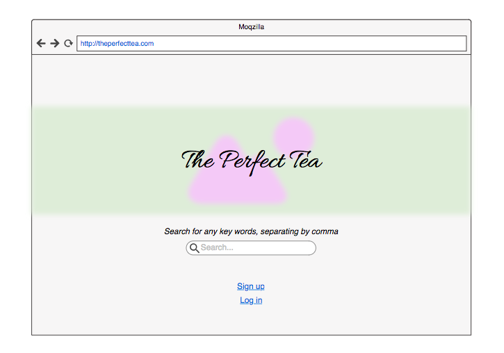
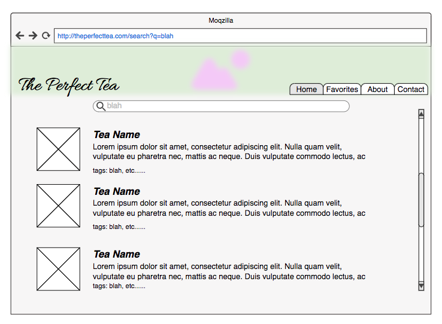
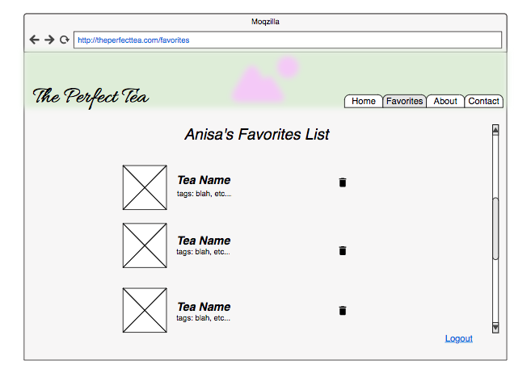

# The Perfect Tea 

## Overview

After water, tea is the most widely consumed beverage on the planet. It's tasty, refreshing, and carries a number of health benefits. For centuries people have drank tea for a variety of purposes, including for health and spiritual practices.

Have a sore throat? Trying to detox? Need to relax? Whether you're drinking for health purposes or just to calm your nerves, The Perfect Tea web application is here to help. 

Users can search key words associated with the tea to suit their needs. These search words operate as tags, which will be used to filter through the database of teas to find matches. The user can then select which tea they'd like to learn more about based off of the search results. 
Users also have the option to create accounts, so as to save their favorite teas in a favorites tab or a wishlist.


## Data Model

The application will store tea types, tags, and users and lists

* the teas and the tags will reference one another (references)
* users will each have a favorites list associated with them, which contains references to different tea types


An Example Tea Schema:

```javascript
{
  name: "Green",
  desc: //description of tea origins, properties, whatnot,
  tags: "antioxidant", etc. //a reference to tag documents that contain this tea
}
```

An Example Tag Schema
```javascript
{
  tag: "antioxidant",
  teas: "Green", etc. //a reference to tea documents that contain this tag
}
```

An Example User:

```javascript
{
  username: "teabee",
  hash: // a password hash,
  list: // an array of references to tea documents
}
```


## [Link to Commented First Draft Schema](db.js) 


## Wireframes

/- landing page



/... - page generating search results



/favorites - page for showing user's saved teas



## Site map

[sitemap](documentation/sitemap.pdf)

## User Stories or Use Cases

1. as non-registered user, I can search for teas related to my key words
2. as a user, I can log in to the site
3. as a user, I can save searches and teas in my favorites list

## Research Topics

*(2 points) CSS framework with Bootstrap

*(3 points) Chart.js -> possible charts to display which tea maps most closely to search?

*(3-4 points) user authentication.... extra library or randomly generated pin number?

## [Link to Initial Main Project File](app.js) 

## Annotations / References Used

[tea object information]https://ratetea.com/styles.php
